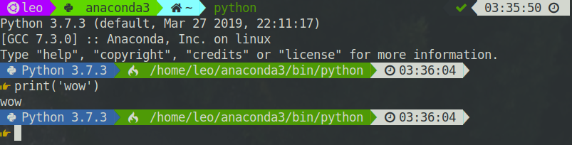

# power-python-prompt

a pretty powerline style python prompt

Inspired by the [The Interactive Startup File](https://docs.python.org/3/tutorial/appendix.html#the-interactive-startup-file) in tht Python3 document.



## Requirement

a [Nerd Font](https://github.com/ryanoasis/nerd-fonts) is needed to display the
awesome little icons.

## Installation

first clone this repository and link the file `.pythonrc.py` with
`~/.pythonrc.py`

```shell
git clone https://github.com/LeoJhonSong/power-python-prompt.git
cd power-python-prompt
ln -s $(pwd)/.pythonrc.py ~
```

then we have to add an environment variable named **PYTHONSTARTUP** to the name
of the `pythonrc.py` file

if you are using **bash**:

```shell
echo -e "# add PYTHONSTARTUP for configuration of interactive Python\nexport PYTHONSTARTUP=~/.pythonrc.py" >> ~/.bashrc
```

if you are using **zsh**:

```
echo -e "# add PYTHONSTARTUP for configuration of interactive Python\nexport PYTHONSTARTUP=~/.pythonrc.py" >> ~/.zshrc
```

if you are using **other shells,** please modify the command based on the above one.

